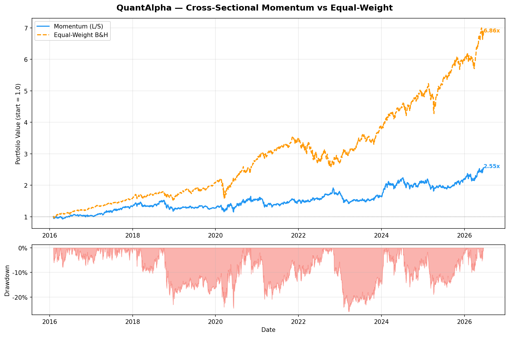

# QuantAlpha

A systematic quant trading and portfolio management framework built in Python.
Developed as part of my path toward an MFE program and a career in quantitative finance.

## Author
Diego Mella Valerio — MSc Financial Engineering, UAI Chile  
Experience: VaR, XVA, P&L Explain @ Tanner Servicios Financieros | Murex MX.3 Test Engineer  
GitHub: [dmellav-quant](https://github.com/dmellav-quant)

---

## Project Structure
QuantAlpha/

├── data/loaders/equity.py          ← Multi-asset price downloader (yfinance)

├── signals/momentum/

│   └── cross_sectional.py          ← 12-1 cross-sectional momentum signal

├── backtest/

│   └── vectorized.py               ← Vectorized backtest engine

├── notebooks/

│   ├── 01_momentum_backtest.py     ← Backtest runner + chart

│   └── momentum_backtest.png       ← Equity curve output

├── signals/mean_reversion/         ← Coming soon

├── signals/options/                ← Coming soon

├── portfolio/                      ← Coming soon

└── risk/                           ← Coming soon

---

## Strategy 1 — Cross-Sectional Momentum

**Universe:** 56 assets across US equities, international equities, fixed income, commodities, real estate, and volatility.

**Signal:** Classic 12-1 momentum — each asset's return over the past 12 months (skipping the last month to avoid short-term reversal). Assets ranked cross-sectionally. Top third = long, bottom third = short, middle = neutral.

**Rebalance:** Monthly (every 21 trading days)

### Backtest Results (2015–2026)

| Metric | Momentum L/S | Equal-Weight B&H |
|---|---|---|
| CAGR | 9.48% | 20.44% |
| Sharpe | 0.57 | 1.20 |
| Max Drawdown | -25.94% | -28.20% |
| Ann. Volatility | 19.04% | 16.71% |

> **Note:** The equal-weight benchmark is dominated by high-momentum tech stocks (NVDA, META, AAPL) which have had exceptional returns 2015–2026. The momentum strategy's key advantage is its **lower max drawdown** and market-neutral long/short structure.

---

## Roadmap

- [x] Data pipeline (multi-asset, yfinance)
- [x] Cross-sectional momentum signal
- [x] Vectorized backtest engine
- [ ] Mean reversion signal
- [ ] Options signal (implied vol surface)
- [ ] Portfolio optimizer (mean-variance + risk parity)
- [ ] Risk module (VaR, CVaR, factor exposures)
- [ ] Full tear sheet (Sharpe, Calmar, rolling metrics)
