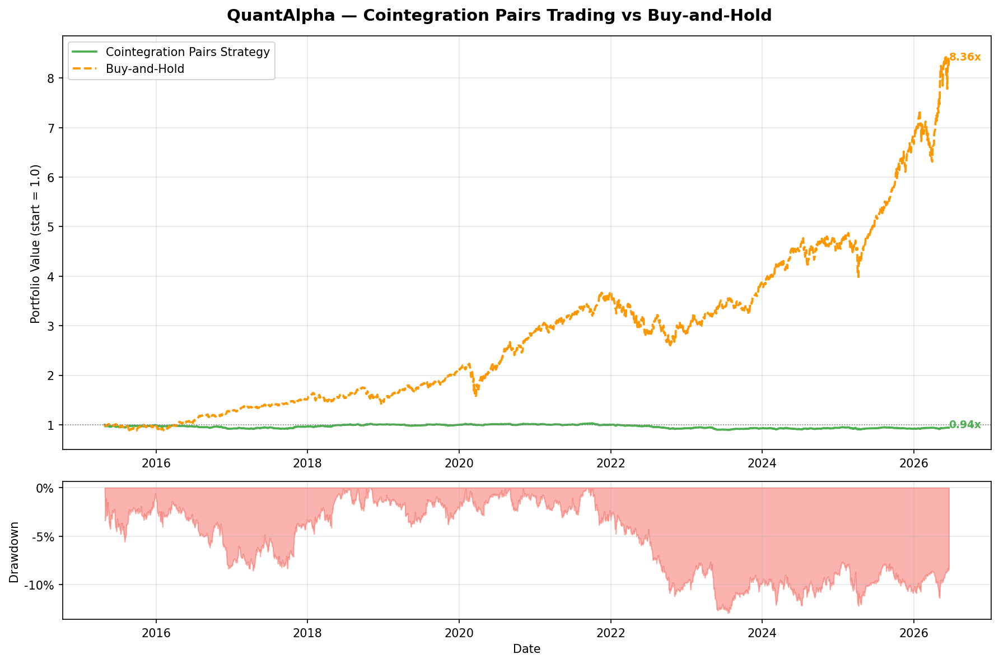

# QuantAlpha

A systematic quantitative trading and portfolio management framework built in Python.
Developed as part of my path toward an MFE program and a career in quantitative finance
at a top-tier bank or hedge fund.

## Author
Diego Mella Valerio — MSc Financial Engineering, UAI Chile
Experience: VaR, XVA, P&L Explain @ Tanner Servicios Financieros | Murex MX.3 Test Engineer
GitHub: [dmellav-quant](https://github.com/dmellav-quant)

---

## Project Structure

    QuantAlpha/
    ├── data/
    │   └── loaders/
    │       └── equity.py                   ← Multi-asset price downloader (yfinance)
    ├── signals/
    │   ├── momentum/
    │   │   └── cross_sectional.py          ← 12-1 cross-sectional momentum signal
    │   └── mean_reversion/
    │       └── pairs_trading.py            ← Cointegration-based pairs trading signal
    ├── backtest/
    │   ├── vectorized.py                   ← Vectorized backtest engine (momentum)
    │   └── pairs_backtest.py               ← Vol-scaled pairs backtest engine
    ├── notebooks/
    │   ├── 01_momentum_backtest.py         ← Momentum backtest runner + chart
    │   ├── momentum_backtest.png           ← Momentum equity curve
    │   └── pairs_coint_backtest.png        ← Pairs trading equity curve
    ├── documentation/
    │   └── QuantAlpha_Summary.docx         ← Project summary + metrics glossary
    ├── risk/                               ← Coming next: VaR, CVaR, Calmar, rolling Sharpe
    ├── portfolio/                          ← Planned: mean-variance + risk parity optimizer
    ├── LIMITATIONS.md                      ← Honest assessment of strategy limitations
    └── README.md

---

## Strategies Implemented

### Strategy 1 — Cross-Sectional Momentum

**Universe:** 56 assets across US equities, international equities, fixed income, commodities, real estate, and volatility.

**Signal:** Classic 12-1 momentum — each asset's return over the past 12 months (skipping the last month to avoid short-term reversal). Assets ranked cross-sectionally. Top third = Long, bottom third = Short, middle = Neutral.

**Rebalance:** Monthly (every 21 trading days)

#### Backtest Results (2015–2026)

| Metric | Momentum L/S | Equal-Weight B&H |
|---|---|---|
| CAGR | 9.48% | 20.44% |
| Sharpe | 0.57 | 1.20 |
| Max Drawdown | -25.94% | -28.20% |
| Ann. Volatility | 19.04% | 16.71% |

> **Note:** The equal-weight benchmark is heavily influenced by exceptional individual stocks (NVDA, META, AAPL). The momentum strategy's key advantage is its lower max drawdown and market-neutral long/short structure. Against SPY alone (~12% CAGR), the strategy is more competitive.

---

### Strategy 2 — Pairs Trading (Mean Reversion)

**Approach:** Engle-Granger cointegration test across all possible pairs in a 30-asset universe. Top 10 statistically cointegrated pairs selected. For each pair, a rolling OLS hedge ratio is computed, spread normalized into a z-score, and positions entered when z > 1.5 (short spread) or z < -1.5 (long spread). Position sizing is volatility-scaled so each pair targets 10% annualized vol.

**Universe:** SPY, QQQ, IWM, sector ETFs, GLD, SLV, USO, TLT, IEF, HYG, LQD, EEM, EFA, EWZ, FXI, EWJ, NVDA, AMD, INTC, QCOM, MSFT, AAPL, GOOG, META, GS, BAC

**Top cointegrated pairs found:** SLV/AMD, EWJ/GOOG, XLK/XLI, EFA/GOOG, GLD/GS, XLV/QCOM, GLD/AMD, GLD/GOOG, QQQ/XLI, AMD/GOOG

#### Backtest Results (2015–2026)

| Metric | Pairs Strategy | Buy-and-Hold |
|---|---|---|
| CAGR | -0.53% | 21.04% |
| Sharpe | -0.10 | 1.11 |
| Max Drawdown | -12.93% | -29.21% |
| Ann. Volatility | 4.25% | 18.83% |

> **Honest assessment:** The pairs strategy underperforms due to look-ahead bias in pair selection and structural decay of pairs trading alpha in US equities post-2002. The strategy generates extremely low volatility (4.25%) and shallow drawdowns (-12.93%), confirming its market-neutral character. Full analysis in [LIMITATIONS.md](LIMITATIONS.md).

---

## Key Technical Concepts

| Concept | Where implemented |
|---|---|
| Cross-sectional ranking | signals/momentum/cross_sectional.py |
| 12-1 momentum (skip period) | signals/momentum/cross_sectional.py |
| Rolling OLS hedge ratio | signals/mean_reversion/pairs_trading.py |
| Z-score normalization | signals/mean_reversion/pairs_trading.py |
| Engle-Granger cointegration | signals/mean_reversion/pairs_trading.py |
| Volatility scaling | backtest/pairs_backtest.py |
| Vectorized backtesting | backtest/vectorized.py |
| CAGR, Sharpe, Max Drawdown, Calmar | backtest/vectorized.py, backtest/pairs_backtest.py |

---

## Roadmap

- [x] Data pipeline (multi-asset, yfinance + curl_cffi)
- [x] Cross-sectional momentum signal (12-1, 56-asset universe)
- [x] Vectorized backtest engine
- [x] Pairs trading signal (Engle-Granger cointegration)
- [x] Volatility-scaled pairs backtest
- [x] Honest limitations documentation
- [ ] **Next: Risk module** — rolling Sharpe, VaR, CVaR, Calmar, factor exposures
- [ ] Portfolio optimizer — mean-variance + risk parity
- [ ] Options signal — implied vol surface
- [ ] Full institutional tear sheet
- [ ] Rolling out-of-sample cointegration (fix look-ahead bias)

---

## Dependencies

    yfinance
    curl_cffi
    pandas
    numpy
    matplotlib
    statsmodels

Install via:

    "C:\Users\Asus\AppData\Local\spyder-6\envs\spyder-runtime\python.exe" -m pip install yfinance curl_cffi pandas numpy matplotlib statsmodels

---

## Documentation

See [documentation/QuantAlpha_Summary.docx](documentation/QuantAlpha_Summary.docx) for a full project summary including metric definitions, strategy explanations, and MFE interview talking points.

See [LIMITATIONS.md](LIMITATIONS.md) for an honest assessment of what works, what does not, and why.

---

*Target: complete QuantAlpha v1.0 before MFE applications (2026-2027 cycle)*
*Author: Diego Mella Valerio | June 2026*